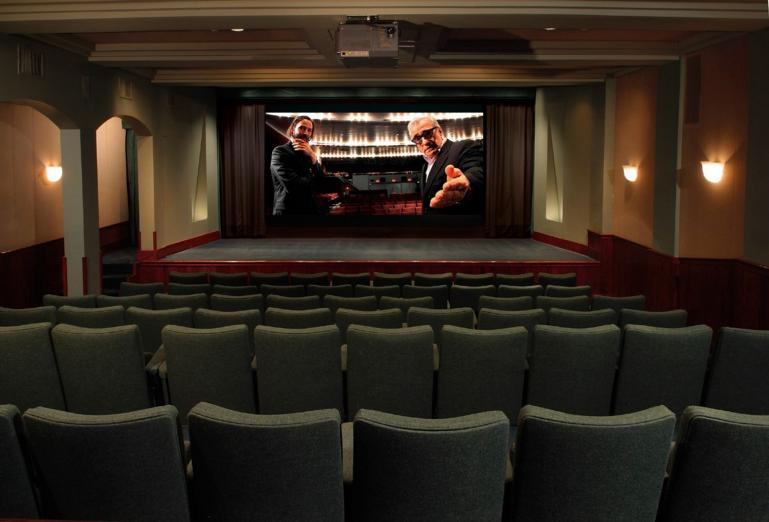
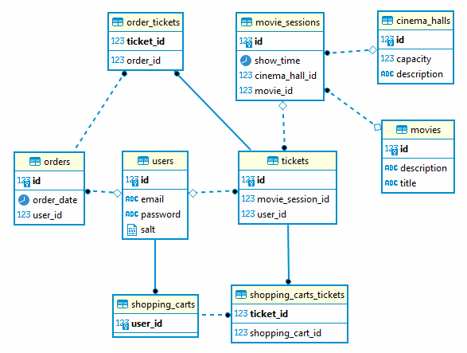

#   
Cinema application
  

*My second application) Let's go!

This application contains the most important part of the full cinema management program. The following code provides such possibilities:

  *  New user registration via email
  *  User login and authentication
  *  Displaying all movies, cinema halls, movie sessions, user orders and tickets on it
  *  Addiing movie to the database and get information about movies
  *  Adding cinema hall to the database and get information about cinema halls
  *  Adding a movie session to the database and get information about available movie sessions
  *  Creating movie show tickets
  *  The user has a shopping cart, where tickets can be added to the order
  *  User can update and complete the order or clear the shopping cart

This app build using SOLID principles. All operations with the database implemented using **Hibernate** framework.
  
#   
Realization details
 
 
To create the service I was used following technologies: MySQL 8 server as database management system and MySQL Workbench as a shel, Hibernate framework 5.6.10 Final version, Apache Maven 3.8 as development tool package and Apache Log4j 2.18 for logging. 

The project uses following architecture:
  * Data Access Layer (DAO)
  * Application layer (service)
  * Security level (security)

# The database structure is here

#   
Installation and using

Must have: JDK (Intellij IDEA Ultimate, Eclipse e.t.c), Git, Apache Maven, MySQL or any other server and (optional) MySQL Workbench. Use guides and Google search for troubleshoot apps installation issues. 
Configure inner logger, use log4j2.xml file from
src/main/resources/
Standart path to log file is 
logs/
Maybe you need to change it to absolute path like "D:/Projects/cinema-application/logs/"
Also You can change log messages and log levels for messages in your code.
Feel free to change the code in Main.class to correct information about movies, cinema halls or users

Run Main.class
